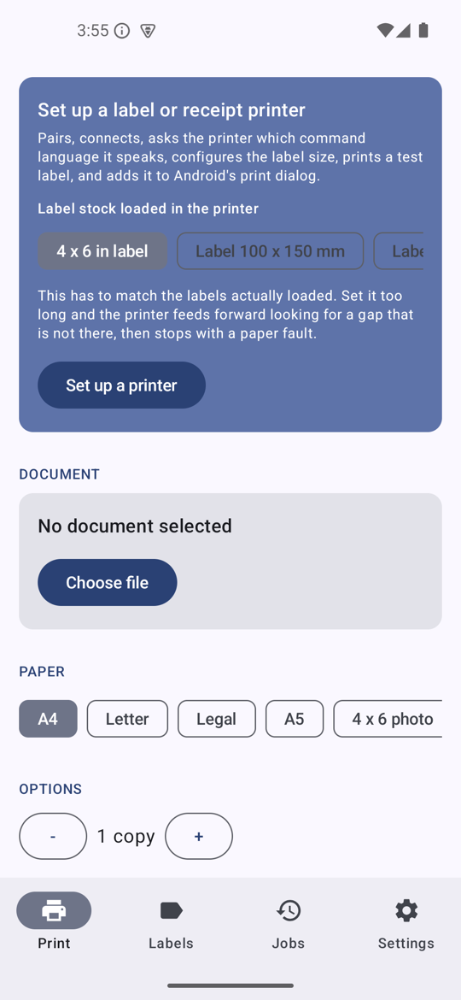
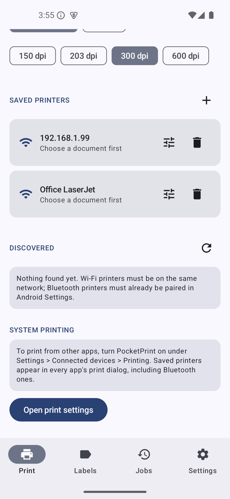
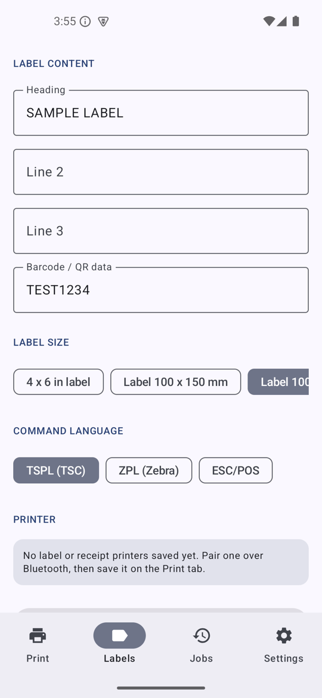
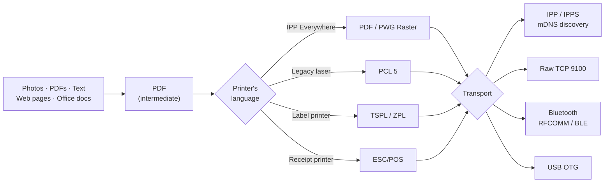

<div align="center">

# PocketPrint

**Print from Android to any printer — Wi-Fi, Bluetooth or USB.**

No cloud service. No account. No telemetry. Everything happens on your device and your LAN.

[](https://github.com/gulshan-bfrs03086/pocketprint/actions/workflows/ci.yml)
[](https://github.com/gulshan-bfrs03086/pocketprint/releases)


[](LICENSE)

<p>
  
  
  
</p>

</div>

---

## The problem this solves

Android prints to Wi-Fi printers perfectly well. But plug in a **Bluetooth thermal label
printer** — the kind that prints shipping labels and receipts — and the system simply cannot
see it. There is no driver, no print dialog entry, nothing. Vendor apps exist, but each one
speaks to exactly one brand, phones home, and can't print a PDF.

PocketPrint registers itself as a **system print service**, so a Bluetooth thermal printer
becomes a real Android printer: it shows up in Gmail, Chrome, Photos, and every other app's
print dialog, alongside your office laser.

## What you can do with it

**Print 4×6 shipping labels straight from your phone.** No PC in the loop. The label designer
builds TSPL/ZPL commands directly, so barcodes are rendered by the printer's own firmware and
stay sharp and scannable at small sizes rather than being blurry images.

**Print in your own script.** A thermal printer's resident fonts hold Latin characters and
nothing else, so Hindi, Arabic, Thai and Chinese come out as rows of question marks — in exactly
the markets that buy these printers. Text the printer cannot carry is laid out on the phone,
with Android's font fallback and its shaping and bidirectional reordering, and sent as an image.
Latin text keeps the fast, crisp printer-font path.

**Print receipts from a handheld.** ESC/POS to any 58 mm or 80 mm thermal printer.

**See what the printer will actually print.** Preview shows the packed one-bit raster on its way
to the head — not a second, prettier rendering of the document. A photo that dithers to mud and a
hairline that falls under the threshold and disappears both show up before a label is consumed
finding out.

**Print from any app to a Bluetooth printer.** Share a PDF from Drive, hit Print in Chrome, or
use the system print dialog — the app converts whatever Android hands it into the printer's own
command language.

**Use the roll you actually have.** Any label size, typed in millimetres — 50×30 and 60×40 are
the two most common rolls on the market. Gap, black-mark or continuous sensing, because a printer
told to look for a gap that is not there feeds forward hunting for one and stops with a paper
fault. Darkness, because a barcode printed too faint scans intermittently and looks like a bad
barcode rather than a heat setting. And a calibrate button for when registration drifts.

**Reach printers nothing else will talk to.** Old network printers with no AirPrint, via raw
port 9100. USB printers over an OTG cable. IPP Everywhere printers that only accept PWG Raster.

**Run on rugged hardware.** The `legacy` build installs on Android 7.0 and on industrial
terminals that lack GPS, a camera or a touchscreen.

## Set up a printer in one tap

Thermal printers don't advertise which command dialect they speak, and guessing from the device
name is how you end up printing a page of literal command text. So PocketPrint asks the printer.

The catch is *what* you ask. These printers often ship with two interpreters and run only one,
but they answer the identification queries of both, so a reply proves the printer exists and
nothing more. Ask for **status** instead, because only the interpreter that is running answers
its own:

```
~!T      →  "4B-2044PA"                  identifies the printer, in either mode
ESC ! ?  →  (silence)                    TSPL is not the interpreter running
~HS      →  <STX>150,0,0,1219,…<ETX>     ZPL is — label calibrated to 1219 dots
```

That printer is a real one, and it settled the question by printing: sent one test label in each
dialect, only the ZPL one came out. Identification alone would have picked TSPL and produced a
printer that accepts every job and silently prints nothing.

TSPL is still checked first, so a printer answering both status commands behaves as it always
did, and identification remains the fallback for firmware that answers neither. If a printer
still ends up on the wrong dialect, override it in the printer's settings — there is a test-page
button right there.

The setup flow pairs, connects, probes for the language, works out the label size and head
width, prints a test label, and registers the printer with Android — showing you what happened
at each step rather than a spinner.

## Setup asks whether the label printed

Because nothing else can. A thermal printer reports paper loaded, head down and no error whether
it just printed a perfect label, fed a blank one, or spat out a page of command text — from its
point of view all three are true. So after the test label, setup asks the one question the
protocol cannot answer, and the three answers point at three different faults:

**Nothing, or a blank label.** This is the paper, and it is the most common first-time failure by
a wide margin. Thermal printers have no ink; they mark heat-sensitive stock, on one side only.
Ordinary paper labels, or a thermal roll loaded upside down, feed perfectly and stay white.

**It printed, but the output is wrong.** *That* one is the command language, and there are only
two candidates — so the dialog offers to switch to the other and print another test.

**It printed and looks right.** The printer is marked as confirmed. On Bluetooth, USB or a raw
socket that is the only confirmation that exists anywhere: none of those protocols reports what
the printer did with the bytes.

## How it works

Everything funnels through PDF as the intermediate representation, then re-encodes into
whatever the target printer actually speaks.



| | |
|---|---|
| **Wi-Fi** | IPP / IPPS, auto-discovered over mDNS. The IPP client is written from scratch — RFC 8010 encoding, RFC 8011 semantics — so there's no opaque dependency between you and the printer. |
| **Raw 9100** | JetDirect / AppSocket, for printers that predate AirPrint. |
| **Bluetooth** | RFCOMM with a four-rung connect ladder — bond, secure SPP, **insecure SPP**, channel-1 fallback. The insecure rung matters: legacy PIN-0000 controllers bring the channel up and then mishandle authentication. Plus BLE/GATT for LE-only printers. |
| **USB** | USB printer class over OTG, with runtime permission brokering. |

PDF pages are rasterised in **horizontal bands**, so a 600 dpi A4 page doesn't try to allocate a
139 MB bitmap.

## Get it

Download from [**Releases**](https://github.com/gulshan-bfrs03086/pocketprint/releases) — two
builds of identical code:

| | `pocketprint-modern.apk` | `pocketprint-legacy.apk` |
|---|---|---|
| Android | **12+** (API 31) | **7.0+** (API 24) |
| Location permission | **none** | `ACCESS_FINE_LOCATION` (API ≤ 30) |
| Size | 18 MB | 19 MB |

**Use `modern` unless your device is older than Android 12.**

Before API 31, scanning for a Bluetooth device required the location permission, because a scan
can reveal position. `BLUETOOTH_SCAN` with `neverForLocation` replaced that — so the modern
build asks for no location access at all. Neither build requires *any* hardware feature, so both
install on devices without GPS, a camera or a touchscreen.

> [!NOTE]
> Releases are built and signed by [a tag-triggered workflow](.github/workflows/release.yml),
> which prints the signing certificate's fingerprint into its log so a downloaded APK can be
> checked against it (`apksigner verify --print-certs`). Checksums are on the release page.
> Anything published before **v1.1.0** is a debug build signed with Android's public debug
> keystore and carries no authenticity guarantee at all — and because debug builds use a
> different package name, the first signed release installs *alongside* it rather than over it.

Then turn the print service on once, under **Settings → Connected devices → Printing →
PocketPrint**. There's a button in the app that takes you straight there, and the app tells you
whether the switch is already on — or says plainly that this version of Android will not let it
find out.

PocketPrint asks for nothing on first launch. Each permission is requested at the moment it is
needed: Bluetooth when you set up a printer, notifications when you print. If one has been
refused to the point where Android stops asking, the app says so and offers the way back.

## Build

```bash
export JAVA_HOME=/Library/Java/JavaVirtualMachines/temurin-17.jdk/Contents/Home

./gradlew assembleModernDebug     # Android 12+
./gradlew assembleLegacyDebug     # Android 7.0+
./gradlew testLegacyDebugUnitTest testModernDebugUnitTest
./scripts/check-required-features.sh   # no required hardware features
```

That last check is a build gate, not a nicety. Android refuses to install a package whose
required hardware features the device lacks, and reports only a generic "Can't install the app".
This app once became uninstallable on a rugged terminal because `ACCESS_FINE_LOCATION` made the
build tools imply `android.hardware.location` as **required**. CI now fails on any such feature.

Versions are built on `release/X.Y` branches and reach `main` by merge, so `main` always holds the
latest — see [docs/RELEASING.md](docs/RELEASING.md). The version is declared once, in
`app/build.gradle.kts`, and both flavours' version codes derive from it.

## Layout

```
model/         Printers, capabilities, media sizes, job records
discovery/     mDNS (NsdManager), Bluetooth (bonded + inquiry), USB enumeration
ipp/           IPP binary codec, HTTP client, capability mapping, PWG media names
transport/     Raw socket, Bluetooth RFCOMM, BLE GATT, USB bulk — plain byte pipes
render/        PDF build/rasterise, PWG raster, PCL raster, WebView, office hook
label/         ESC/POS, TSPL, ZPL command builders
print/         PrintEngine, one-tap setup, foreground job service
printservice/  Android print-framework integration
ui/            Compose screens, view model, theme
```

## Honest status

**Verified against real hardware.** A 4BARCODE 4B-2044PA over Bluetooth SPP: dialect detection,
the exact TSPL byte stream, and label output. The system print service was verified end to end
on an emulator — a saved printer really does reach Android's print dialog.

The rendering path is verified independently of any printer. Debug builds log the dark pixels
per rendered page and the ink coverage of the packed bitmap, and save every generated command
stream under `getExternalFilesDir` for byte-level inspection. On a 4x6 label at 203 dpi a
US Letter page renders to 812 x 1051 dots at 30.02% ink and emits exactly 107,357 bytes of
TSPL. That makes it quick to tell a rendering bug from a printer that is not marking.

**188 unit tests** cover the IPP codec (request framing, multi-value and resolution decoding,
unknown-tag tolerance), PWG raster round trips including band-boundary equivalence, PWG media
name parsing, the exact TSPL output, which document types the exported share target will accept,
the IPP job-state decoding that decides whether a job may be called printed, the per-printer job
queue that keeps two jobs out of one RFCOMM slot, the rules that decide what the system print
dialog is told about a printer, the stall guard that pulls a write out of a printer that has
stopped reading, what the printer report does and does not disclose, and the versioned store that
keeps one unreadable record from taking every saved printer with it, and which label text the
printer's own fonts can carry, the bit order and polarity of the mono raster, and the media
sensing and darkness commands for both label dialects, the failure messages turned into advice,
the two permission readings where "unknown" must not be reported as "no", and the rule that
decides when a socket is bound to the local network. CI builds and tests both variants on every
push.

**What isn't proven.** Coverage beyond that one printer is thin — that's the real gap, and no
amount of code review closes it. Office documents need an external converter (a Gotenberg
instance on your LAN works unmodified). IPPS printers with self-signed certificates don't work
yet. Printers lie about their capabilities in inventive ways, so expect to correct a setting or
two per model — there's a printer-settings screen for exactly that, with a test-page button.

Known gaps are tracked as [open issues](https://github.com/gulshan-bfrs03086/pocketprint/issues).

## License

[Apache License 2.0](LICENSE) — permissive: use it, fork it, ship it commercially,
closed-source if you like.

Apache rather than MIT because this implements several vendor-controlled command
languages (ZPL, ESC/POS, PCL, TSPL). Apache-2.0 adds an express patent grant and
patent-retaliation clause that MIT is silent on, and states explicitly that no
trademark rights are granted — so "this code speaks ZPL" stays clearly separate
from any suggestion of endorsement by Zebra, Epson, HP or TSC. Those names are
their owners' trademarks and are used here only to identify the protocols.

## Contributing

Printer quirks are the most useful thing you can report. If a printer misbehaves, open the
printer's settings and tap **Copy printer report**, then paste it into an issue along with what
actually came out of the printer. It carries the dialect, the head width, how much ink the
rasteriser put on the page and how many bytes reached the printer — which is usually enough to
tell a rendering bug from a printer that is not marking. Read it before you paste it: it names
the documents you printed recently. Bluetooth addresses have their device half removed.

`adb logcat -s BluetoothTransport PrintEngine PocketPrintService` shows the same thing live.
