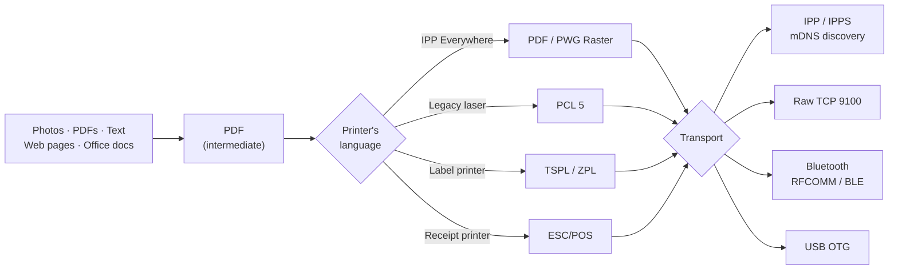

<div align="center">

# PocketPrint

**Print from Android to any printer — Wi-Fi, Bluetooth or USB.**

No cloud service. No account. No telemetry. Everything happens on your device and your LAN.

[](https://github.com/gulshan-bfrs03086/pocketprint/actions/workflows/ci.yml)
[](https://github.com/gulshan-bfrs03086/pocketprint/releases)


[](LICENSE)

<p>
  
  
  
</p>

</div>

---

## The problem this solves

Android prints to Wi-Fi printers perfectly well. But plug in a **Bluetooth thermal label
printer** — the kind that prints shipping labels and receipts — and the system simply cannot
see it. There is no driver, no print dialog entry, nothing. Vendor apps exist, but each one
speaks to exactly one brand, phones home, and can't print a PDF.

PocketPrint registers itself as a **system print service**, so a Bluetooth thermal printer
becomes a real Android printer: it shows up in Gmail, Chrome, Photos, and every other app's
print dialog, alongside your office laser.

### Why not something that already exists

| | Android's built-in printing | A vendor's own app | PocketPrint |
|---|---|---|---|
| Bluetooth thermal / label printers | out of scope for Mopria and AirPrint | that vendor's models | by protocol, not by brand |
| Appears in every app's print dialog | yes | rarely — printing starts inside the app | yes, it registers a `PrintService` |
| Prints an arbitrary PDF or web page | yes | often not | yes |
| Works with no internet at all | yes | varies | yes — nothing leaves the device |
| Source you can read and fork | no | no | Apache-2.0, protocols implemented here |

Google Cloud Print used to cover part of this gap. It was shut down at the end of 2020.

## What you can do with it

**Print 4×6 shipping labels straight from your phone.** No PC in the loop. The label designer
builds TSPL/ZPL commands directly, so barcodes are rendered by the printer's own firmware and
stay sharp and scannable at small sizes rather than being blurry images.

**Print in your own script.** A thermal printer's resident fonts hold Latin characters and
nothing else, so Hindi, Arabic, Thai and Chinese come out as rows of question marks — in exactly
the markets that buy these printers. Text the printer cannot carry is laid out on the phone,
with Android's font fallback and its shaping and bidirectional reordering, and sent as an image.
Latin text keeps the fast, crisp printer-font path.

**Print receipts from a handheld.** ESC/POS to any 58 mm or 80 mm thermal printer.

**See what the printer will actually print.** Preview shows the packed one-bit raster on its way
to the head — not a second, prettier rendering of the document. A photo that dithers to mud and a
hairline that falls under the threshold and disappears both show up before a label is consumed
finding out.

**Print from any app to a Bluetooth printer.** Share a PDF from Drive, hit Print in Chrome, or
use the system print dialog — the app converts whatever Android hands it into the printer's own
command language.

**Use the roll you actually have.** Any label size, typed in millimetres — 50×30 and 60×40 are
the two most common rolls on the market. Gap, black-mark or continuous sensing, because a printer
told to look for a gap that is not there feeds forward hunting for one and stops with a paper
fault. Darkness, because a barcode printed too faint scans intermittently and looks like a bad
barcode rather than a heat setting. And a calibrate button for when registration drifts.

**Reach printers nothing else will talk to.** Old network printers with no AirPrint, via raw
port 9100. USB printers over an OTG cable. IPP Everywhere printers that only accept PWG Raster.

**Run on rugged hardware.** Installs on Android 7.0 and on industrial terminals that lack GPS,
a camera or a touchscreen.

## Set up a printer in one tap

Thermal printers don't advertise which command dialect they speak, and guessing from the device
name is how you end up printing a page of literal command text. So PocketPrint asks the printer.

The catch is *what* you ask. These printers often ship with two interpreters and run only one,
but they answer the identification queries of both, so a reply proves the printer exists and
nothing more. Ask for **status** instead, because only the interpreter that is running answers
its own:

```
~!T      →  "4B-2044PA"                  identifies the printer, in either mode
ESC ! ?  →  (silence)                    TSPL is not the interpreter running
~HS      →  <STX>150,0,0,1219,…<ETX>     ZPL is — label calibrated to 1219 dots
```

That printer is a real one, and it settled the question by printing: sent one test label in each
dialect, only the ZPL one came out. Identification alone would have picked TSPL and produced a
printer that accepts every job and silently prints nothing.

TSPL is still checked first, so a printer answering both status commands behaves as it always
did, and identification remains the fallback for firmware that answers neither. If a printer
still ends up on the wrong dialect, override it in the printer's settings — there is a test-page
button right there.

The setup flow pairs, connects, probes for the language, works out the label size and head
width, prints a test label, and registers the printer with Android — showing you what happened
at each step rather than a spinner.

## Setup asks whether the label printed

Because nothing else can. A thermal printer reports paper loaded, head down and no error whether
it just printed a perfect label, fed a blank one, or spat out a page of command text — from its
point of view all three are true. So after the test label, setup asks the one question the
protocol cannot answer, and the three answers point at three different faults:

**Nothing, or a blank label.** This is the paper, and it is the most common first-time failure by
a wide margin. Thermal printers have no ink; they mark heat-sensitive stock, on one side only.
Ordinary paper labels, or a thermal roll loaded upside down, feed perfectly and stay white.

**It printed, but the output is wrong.** *That* one is the command language, and there are only
two candidates — so the dialog offers to switch to the other and print another test.

**It printed and looks right.** The printer is marked as confirmed. On Bluetooth, USB or a raw
socket that is the only confirmation that exists anywhere: none of those protocols reports what
the printer did with the bytes.

## How it works

Everything funnels through PDF as the intermediate representation, then re-encodes into
whatever the target printer actually speaks.



| | |
|---|---|
| **Wi-Fi** | IPP / IPPS, auto-discovered over mDNS. The IPP client is written from scratch — RFC 8010 encoding, RFC 8011 semantics — so there's no opaque dependency between you and the printer. IPPS uses trust-on-first-use: the platform's trust decision first, then the one certificate you chose to pin for that printer — never a trust-everything manager. |
| **Raw 9100** | JetDirect / AppSocket, for printers that predate AirPrint. |
| **Bluetooth** | RFCOMM with a four-rung connect ladder — bond, secure SPP, **insecure SPP**, channel-1 fallback. The insecure rung matters: legacy PIN-0000 controllers bring the channel up and then mishandle authentication. Plus BLE/GATT for LE-only printers. |
| **USB** | USB printer class over OTG, with runtime permission brokering. |

### What's implemented here rather than pulled in

No printer vendor SDK is used, and the only runtime dependency outside AndroidX, Compose and
kotlinx is OkHttp, which carries IPP's HTTP transport. Every wire format below is encoded and
decoded by code in this repository:

| | Scope | Reference |
|---|---|---|
| **IPP encoding** | attribute groups, value tags, multi-value and resolution decoding, unknown-tag tolerance | RFC 8010 |
| **IPP semantics** | `Print-Job`, `Get-Printer-Attributes`, `Get-Job-Attributes`, `job-state` | RFC 8011 |
| **PWG Raster** | header and banded raster, round-tripped in tests including band boundaries | PWG 5102.4 |
| **PWG media names** | `na_letter_8.5x11in`, `iso_a4_210x297mm`, `om_label_100x150mm` and custom sizes | PWG 5101.1 |
| **PCL 5** | raster graphics, for lasers that predate AirPrint | HP language |
| **TSPL / ZPL** | label geometry, gap and black-mark sensing, darkness, speed, firmware barcodes | TSC / Zebra languages |
| **ESC/POS** | receipt text and raster | Epson language |
| **mDNS** | `_ipp._tcp` and `_ipps._tcp` browsing via `NsdManager`, under a multicast lock | — |

PDF pages are rasterised in **horizontal bands**, so a 600 dpi A4 page doesn't try to allocate a
139 MB bitmap.

## Why this is harder than it looks

Every item below was a real defect in this app, and every one is now a test, a type, or a build
gate. They are the reason the code is shaped the way it is.

**"Sent" is not "printed."** A socket write returns when the OS accepts the bytes, not when a
label comes out. This app once reported six completed jobs while the printer produced six blank
labels. There is no `PrintResult.Success` any more: `Delivered`, `Sent` and `Completed` are
different claims, and an IPP job is polled to `job-state` 9 before anything is called printed.

**A print job is not a data sync.** The foreground service was typed `dataSync`, which Android 15
caps at six hours a day and then times out. It is `connectedDevice` — which is what driving a
peripheral actually is, and is not capped.

**Cancelling a coroutine does not stop a blocking write.** `write(2)` into a wedged RFCOMM socket
ignores cancellation; only closing the socket underneath it returns. Every send runs under a
stall guard that does exactly that, with a deadline and a cancel button.

**A printer-only access point has no internet, so Android keeps cellular as the default route.**
A socket opened without saying otherwise never reaches the printer — which is the whole of "it
finds my printer but won't print". Sockets are bound to the network the printer is actually on.

**Thermal printer fonts are ISO-8859-1.** Hindi, Arabic, Thai and Chinese came out as rows of
question marks, in exactly the markets that buy these printers. Text the firmware cannot carry is
shaped and laid out on the phone — Android's font fallback, bidi reordering and all — and sent as
a raster. Latin text keeps the fast printer-font path.

**One unreadable record used to erase every saved printer.** A single decode failure took the
whole store with it. Records are decoded individually now, and one that cannot be read is
quarantined rather than fatal.

**A printer does not round an unsupported resolution; it refuses the job.** The client sent
`printer-resolution` at whatever the options said — 300 dpi by default — and CUPS's reference
implementation, which offers 600 only, answered `client-error-attributes-or-values-not-supported`
to every job. Many lasers advertise a single resolution. The nearest one the printer offers is
sent instead, and nothing at all when the printer's list is unknown, because a wrong guess is
fatal and the printer's own default never is. Found by the first run against a real server.

**Version codes only ever increase.** Collapsing two build flavours into one would have derived a
code *below* what was already published — refusing the update on every device with the app
installed, recoverable only by an uninstall that discards the user's printers. A `require()`
fails the build rather than shipping that.

## Get it

Download `pocketprint.apk` from
[**Releases**](https://github.com/gulshan-bfrs03086/pocketprint/releases). One build, no variants
to choose between:

| | |
|---|---|
| Android | **7.0+** (API 24) |
| Size | 1.9 MB |
| Location permission | **none** |
| Required hardware | **none** |

It asks for no location permission, and none to scan. Pairing goes through Android's own
companion device picker, which scans on the app's behalf — an app that does not scan does not
need permission to. Earlier versions carried `ACCESS_FINE_LOCATION`, because a Bluetooth scan
below API 31 required it, which is how this app once became uninstallable on a rugged terminal
with no GPS.

It requires *no* hardware feature, so it installs on devices without GPS, a camera or a
touchscreen.

### Installing

It is not on Google Play, so this is a sideload:

1. Get `pocketprint.apk` onto the device — download it there, or copy it across.
2. Open it. Android asks whether to allow installs from whatever app you opened it with, a
   browser or Files. That permission is per-app, and can be switched back off afterwards.
3. Install.

Over a cable instead:

```bash
adb install -r pocketprint.apk
```

`-r` reinstalls in place and keeps the app's data, which is where your configured printers live.

### Upgrading

| Installed | What happens |
|---|---|
| **v1.1.0**, either `-modern` or `-legacy` | Installs straight over it. Same signing key, same `com.gulshan.pocketprint`, higher version code — your printers are kept. |
| **v1.0.x** | Installs **alongside**, leaving two apps. Those were debug builds under `com.gulshan.pocketprint.debug`, which Android treats as an unrelated app. Uninstall the old one; its printers do not carry over. |
| nothing | Nothing special. |

v1.2.0 is the first release to replace the separate `modern` and `legacy` APKs. They differed by
a single install-time permission that Android 12 ignores anyway, which was not worth two of every
file and sentence describing them.

### Checking what you downloaded

The APK is signed with a key held outside this repository. Every release since v1.1.0 carries the
same certificate, so this fingerprint should match whatever you download:

```bash
apksigner verify --print-certs pocketprint.apk
# V3.0 Signer: certificate SHA-256 digest: 9c722e39d5d3cb111d6a0540d3b3dd480eebd6f54c588afc73db1fc05b90b39e
```

A different fingerprint means a different key — and Android will refuse to install it over a copy
signed with this one. Per-release SHA-256 sums are in `SHA256SUMS.txt` on each release page.

> [!WARNING]
> Anything published before **v1.1.0** is a debug build signed with Android's public AOSP debug
> keystore — a key that ships with the SDK and that everyone has. Those downloads carry no
> authenticity guarantee whatsoever: anyone could have built a package that installs over them
> and inherits the print service, which sees every document you print. Replace them.

### Turning the print service on

One switch, once, under **Settings → Connected devices → Printing → PocketPrint**. There's a
button in the app that takes you straight there, and the app tells you whether the switch is
already on — or says plainly that this version of Android will not let it find out.

PocketPrint asks for nothing on first launch. Each permission is requested at the moment it is
needed: Bluetooth when you set up a printer, notifications when you print. If one has been
refused to the point where Android stops asking, the app says so and offers the way back.

## Build

```bash
export JAVA_HOME=/Library/Java/JavaVirtualMachines/temurin-17.jdk/Contents/Home

./gradlew assembleDebug
./gradlew testDebugUnitTest
./scripts/check-required-features.sh   # no required hardware features
./scripts/check-permissions.sh         # asks for exactly what the docs say
./scripts/check-platform-packages.sh   # one non-SDK dependency, and it has a fallback
./scripts/check-printservice-threading.sh   # framework handles never leave the main thread
```

Those four are build gates, not niceties. Each runs in CI against the built APKs — debug and
release — and each exists because of something that already went wrong once:

| Gate | What it refuses to let happen again |
|---|---|
| `check-required-features` | An implied **required** hardware feature. `ACCESS_FINE_LOCATION` once made the build tools imply `android.hardware.location`, and Android will not install a package whose required features the device lacks — it reported only "Can't install the app", on a rugged terminal with no GPS. |
| `check-permissions` | The permission set drifting away from the prose that describes it. What the app asks for is checked in as data and diffed against the APK, both ways, so a silent *removal* fails as loudly as an addition. Four descriptions of it went stale simultaneously; one of them reached a release page. |
| `check-platform-packages` | A second class appearing inside `android.print`, or the fallback for the one that's there quietly becoming unwired. |
| `check-printservice-threading` | A print-framework handle reaching a worker thread. Every method on `PrintJob`, `generatePrinterId`, `addPrinters` throws `IllegalAccessError` off the main thread — an *Error*, which `runCatching` swallows — and the symptom is a print dialog that searches forever. Three separate violations presented exactly that way. One file may hold those handles and is forbidden from dispatching; every other file may only pass a `PrintJob` straight to it. |

That last gate guards the single place this app reaches outside the public SDK. WebView's
`PrintDocumentAdapter` is the only thing that paginates HTML properly, and driving it without the
system print dialog needs a class placed inside the `android.print` package, where the result
callbacks have package-private constructors. That works today, is unsupported, and would take
every shared link and HTML document down together the day it stops. So it has a public-API
fallback — `PdfDocument` and `WebView.draw`, worse output but a document that prints — and the
gate fails if a second platform-package class appears or if the fallback stops being wired in.

Versions are built on `release/X.Y` branches and reach `main` by merge, so `main` always holds the
latest — see [docs/RELEASING.md](docs/RELEASING.md). The version is declared once, in
`app/build.gradle.kts`, and the version code derives from it.

## Translating it

Every string a user reads is in `app/src/main/res/values/strings.xml`, with positional format
arguments so a translation can reorder them. Adding a language is a `values-xx/strings.xml` and
one line in [`locales_config.xml`](app/src/main/res/xml/locales_config.xml), after which Android
lists the app under **Settings → Apps → App languages**.

Two things are deliberately left in English. Protocol vocabulary — TSPL, ZPL, ESC/POS, and IPP's
own `job-state` keywords — because those are the protocols' names for themselves. And the
technical text a transport produces when it fails, because that is what gets pasted into a bug
report; what a person can *act* on is a separate, translated sentence shown above it.

## Layout

```
model/         Printers, capabilities, media sizes, job records
discovery/     mDNS (NsdManager), Bluetooth (bonded + inquiry), USB enumeration
ipp/           IPP binary codec, HTTP client, capability mapping, PWG media names
transport/     Raw socket, Bluetooth RFCOMM, BLE GATT, USB bulk — plain byte pipes
render/        PDF build/rasterise, PWG raster, PCL raster, WebView, office hook
label/         ESC/POS, TSPL, ZPL command builders
print/         PrintEngine, one-tap setup, foreground job service
printservice/  Android print-framework integration
ui/            Compose screens, view model, theme
```

## Honest status

**Verified against real hardware.** A 4BARCODE 4B-2044PA over Bluetooth SPP: dialect detection,
the exact TSPL byte stream, and label output. The system print service was verified end to end
on an emulator — a saved printer really does reach Android's print dialog.

**Verified against a real IPP server.** The IPP client runs in CI against `ippeveprinter`, the
IPP Everywhere reference implementation that ships with CUPS — a real server that validates
media against what it supports, moves jobs through their states, and stores exactly the bytes it
was sent. Get-Printer-Attributes maps to sane capabilities; a Print-Job PDF completes and is
held byte-identical; a PWG raster job completes and its 1796-byte page header reads correctly at
the spec's offsets through a parser first validated against a file Apple's own `rastertopwg`
wrote; copies, media and page-ranges come back in the job as sent. That run found a real bug:
the client sent `printer-resolution` as asked, and a printer that does not offer that resolution
refuses the whole job rather than rounding — see below. Not a physical printer, so what a print
head does with the raster and whether Android's mDNS discovery finds it are still not shown.
IPPS is exercised live in CI too: Ubuntu's build of the emulator serves TLS from a self-signed
certificate, and the run shows the printer refused with no pin, the refusal naming the
certificate's real fingerprint, and the same printer answering once that fingerprint is pinned.
macOS's build keeps its credentials in the keychain and ignores the key directory, so on a Mac
that one test skips, saying so.

The rendering path is verified independently of any printer. Debug builds log the dark pixels
per rendered page and the ink coverage of the packed bitmap, and save every generated command
stream under `getExternalFilesDir` for byte-level inspection. On a 4x6 label at 203 dpi a
US Letter page renders to 812 x 1051 dots at 30.02% ink and emits exactly 107,357 bytes of
TSPL. That makes it quick to tell a rendering bug from a printer that is not marking.

**122 unit tests** cover the IPP codec (request framing, multi-value and resolution decoding,
unknown-tag tolerance), PWG raster round trips including band-boundary equivalence, PWG media
name parsing, the exact TSPL output, which document types the exported share target will accept,
the IPP job-state decoding that decides whether a job may be called printed, the per-printer job
queue that keeps two jobs out of one RFCOMM slot, the rules that decide what the system print
dialog is told about a printer, the stall guard that pulls a write out of a printer that has
stopped reading, what the printer report does and does not disclose, and the versioned store that
keeps one unreadable record from taking every saved printer with it, and which label text the
printer's own fonts can carry, the bit order and polarity of the mono raster, and the media
sensing and darkness commands for both label dialects, the failure messages turned into advice,
the two permission readings where "unknown" must not be reported as "no", the rule that decides when a socket is
bound to the local network, and the end-of-stream case that Android 17 turns from an exception
into a silent -1. CI builds and tests debug and release on every push.

**What isn't proven.** Coverage beyond that one printer is thin — that's the real gap, and no
amount of code review closes it. Office documents need an external converter (a Gotenberg
instance on your LAN works unmodified). IPPS printers present certificates they signed
themselves; the app pins one on first use, after showing you the fingerprint to check against
the printer's own status page. Printers lie about their capabilities in inventive ways, so expect to correct a setting or
two per model — there's a printer-settings screen for exactly that, with a test-page button.

Known gaps are tracked as [open issues](https://github.com/gulshan-bfrs03086/pocketprint/issues).

## License

[Apache License 2.0](LICENSE) — permissive: use it, fork it, ship it commercially,
closed-source if you like.

Apache rather than MIT because this implements several vendor-controlled command
languages (ZPL, ESC/POS, PCL, TSPL). Apache-2.0 adds an express patent grant and
patent-retaliation clause that MIT is silent on, and states explicitly that no
trademark rights are granted — so "this code speaks ZPL" stays clearly separate
from any suggestion of endorsement by Zebra, Epson, HP or TSC. Those names are
their owners' trademarks and are used here only to identify the protocols.

## Contributing

Printer quirks are the most useful thing you can report. If a printer misbehaves, open the
printer's settings and tap **Copy printer report**, then paste it into an issue along with what
actually came out of the printer. It carries the dialect, the head width, how much ink the
rasteriser put on the page and how many bytes reached the printer — which is usually enough to
tell a rendering bug from a printer that is not marking. Read it before you paste it: it names
the documents you printed recently. Bluetooth addresses have their device half removed.

`adb logcat -s BluetoothTransport PrintEngine PocketPrintService` shows the same thing live.
